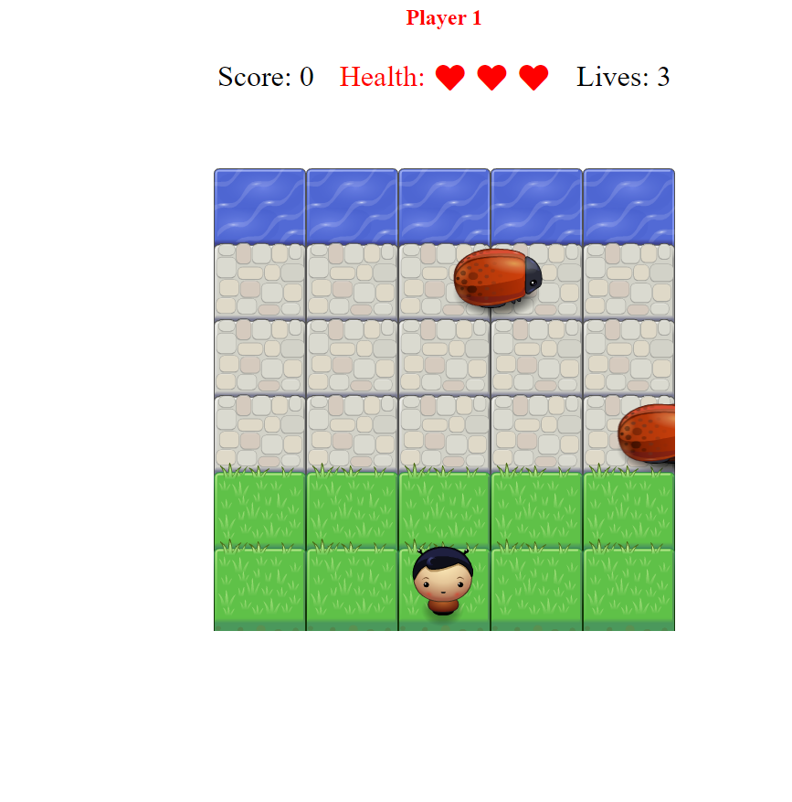

# [Frontend-nanodegree-arcade-game](https://github.com/qcardell/arcadegame.git)

In this game you have a Player and Enemies (Bugs). The goal of the player is to reach the water, without colliding into any one of the enemies. The player can move left, right, up and down. The enemies move in varying speeds on the paved block portion of the scene. Once a the player collides with an enemy, the game is reset and the player moves back to the start square. Once the player reaches the water the game is won.

See how fast you can Dodge the enemies and make it to the water without getting hit.

# Getting Started
Complete Web base game no installing required.  Just load, play and enjoy.

# Run this application locally.

### Download/clone this application using web browser:

* Go to [Link](https://github.com/qcardell/arcadegame.git)
* Click Clone or download.
* Click Download Zip File.
* After download is complete unzip files.  
* Run the index file in any browser and enjoy.

# Built With
- JavaScript - Computer programming language used for the interactive effects within the Brower.
- fontawsome - Used to generate the vector icons with only using Font 

# Versioning
Version 1

# Authors
Quinnton Cato - Initial work

# Acknowledgments
Graphics:

- Provide from Udacity Nano degree program.

